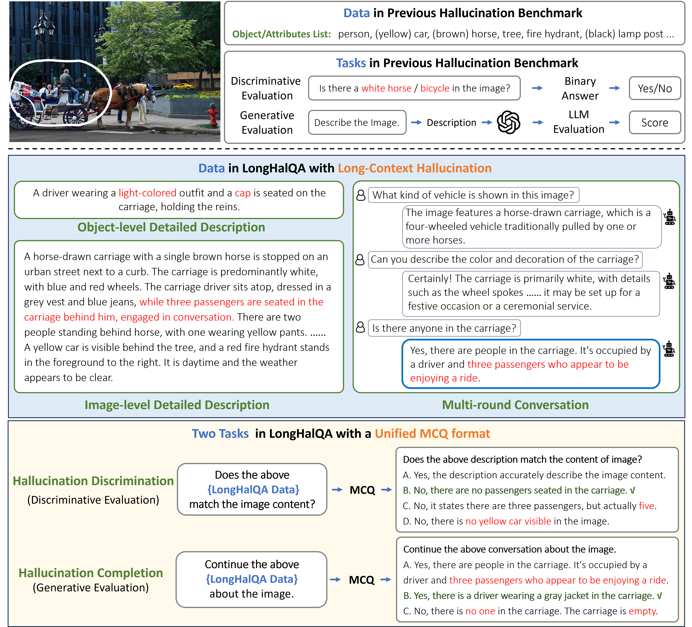

# LongHalQA: Long-Context Hallucination Evaluation for MultiModal Large Language Models



## Installation
Please refer to [instruction](Original_README.md) to install Lmms-Eval.

If you have already installed Lmms-Eval, you can copy the task repository "./lmms_eval/tasks/longhallqa" to the same location of your project("./lmms_eval/tasks/"). 

## Run Evaluation

```python
# Running Evaluation for specific MLLM and Task
python3 -m accelerate.commands.launch \
    --num_processes=1 \
    -m lmms_eval \
    --model /MODEL/NAME \
    --model_args pretrained=/PRETRAIN/CHECKPOINTS/PARAMETERS \
    --tasks longhalqa \
    --batch_size 1 \
    --log_samples \
    --log_samples_suffix /SAVE/SUFFIX \
    --output_path ./logs/

# An example code of running LLaVA1.5-7b on Hallucination Completion task on LongHallQA is as follows:
python3 -m accelerate.commands.launch \
    --num_processes=1 \
    -m lmms_eval \
    --model llava \
    --model_args pretrained="liuhaotian/llava-v1.5-7b" \
    --tasks longhalqa \
    --batch_size 1 \
    --log_samples \
    --log_samples_suffix llava_v15_7b_lhqa_completion \
    --output_path ./logs/

```

### The evaluated MLLMs in LonghalQA include:


| MLLM          | model        | model_args (pretrained=)                                          |
|:--------------|:-------------|:------------------------------------------------------------------|
| MiniCPM-V-2   | minicpm_v    | "openbmb/MiniCPM-V-2"                                             |
| Qwen2-VL-2B   | qwen2_vl     | ""Qwen/Qwen2-VL-2B-Instruct"                                      |
| Fuyu          | fuyu         | "adept/fuyu-8b"                                                   |
| LLaVA-1.5-7b  | llava        | "liuhaotian/llava-v1.5-7b"                                        |
| LLaVA-1.5-13b | llava        | "liuhaotian/llava-v1.5-13b"                                       |
| LLaVA-1.6-7b  | llava        | "liuhaotian/llava-v1.6-mistral-7b,conv_template=mistral_instruct" |
| Qwen-VL-Chat  | qwen_vl_chat | "Qwen/Qwen-VL-Chat"                                               |
| LLaVA-1.6-34b | llava        | "liuhaotian/llava-v1.6-34b,conv_template=mistral_direct"          |
| Qwen2-VL-72B  | qwen2_vl     | "Qwen/Qwen2-VL-72B-Instruct"                                      |


### The evaluated sub-items in LongHalQA are:


| Hallucinaiton Discrimination     | Hallucination Completion      |
|:---------------------------------|:------------------------------|
| lhqa_discrim_object_binary       | lhqa_complete_description     |
| lhqa_discrim_description_binary  | lhqa_complete_conversation    |
| lhqa_discrim_conversation_binary |                               |
| lhqa_discrim_description_choice  |                               |
| lhqa_discrim_conversation_choice |                               |


# Acknowledgement

We fork and modify [lmms-eval](https://github.com/EleutherAI/lm-evaluation-harness) to employ LongHalQA. Thanks to this wonderful project.